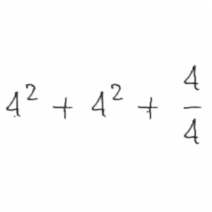

# Handwritten Mathematical Recognition

## Steps

### 1. Preprocessing

This is for the data preprocessing. If you have already [downloaded](https://drive.google.com/open?id=1zlsVRFXSdPhcjKEIKvTNShcTpTUe_VAe) the dataset like the following, just skip it.

```
── {dataset-name}       <- dataset name e.g. mnist, crohme or im2latex
   ├── annotations      <- math formular latex code
   │   ├── dev.csv      <- csv files, in format of id,formula
   │   ├── test.csv
   │   ├── train.csv
   |   └── vocab.csv    <- vocab build by scripts/data/build_vocab.py
   └── features         <- math formular images
       ├── printed      <- printed version
       │   ├── dev
       │   ├── test
       │   └── train
       └── written      <- written version
           ├── dev
           ├── test
           └── train
```

1. Install [nodejs](https://nodejs.org/en/) and [npmjs](https://www.npmjs.com/), and then run `npm install` under the project root.

```
$ sudo apt install nodejs npm
$ npm install
```

2. Run the following script to build crohme dataset

```
$ scripts/data/create_crohme19.sh data/crohme
```

3. Run the following script to build mnist dataset

```
$ scripts/data/create_mnist.py data/mnist
```

4. Run the following script to build im2latex dataset

```
$ scripts/data/create_im2latex.py data/im2latex
```

### 2. Train Style Transfers

Train style transfers on mnist and then crohme. Note that crohme should be trained after mnist since it needs the mnist pre-trained model.

```
$ python3 scripts/train_gan.py config/cyclegan/train/mnist.yml
$ python3 scripts/train_gan.py config/cyclegan/train/crohme.yml
```

### 3. Train Seq2seq Model

Train seq2seq on crohme.

```
$ python3 scripts/train_seq2seq.py config/seq2seq/train/crohme.yml
```

Train seq2seq on im2latex.

```
$ python3 scripts/train_seq2seq.py config/seq2seq/train/im2latex.yml
```

Fine-tune seq2seq on crohme based on the im2latex pre-trained model.

```
$ python3 scripts/train_seq2seq.py config/seq2seq/train/fine_tune.yml
```

### 4. Evaluation

Generate fake printed and fake written data based on the cyclegan model.

```
$ python3 scripts/forward_gan.py config/cyclegan/forward/crohme.yml
```

Evaluate seq2seq trained on crohme.

```
$ python3 scripts/eval_seq2seq.py config/seq2seq/eval/crohme.yml
```

Evaluate seq2seq trained on im2latex using im2latex test set.

```
$ python3 scripts/eval_seq2seq.py config/seq2seq/eval/im2latex.yml
```

Evaluate seq2seq trained on im2latex using crohme test set.

```
$ python3 scripts/eval_seq2seq.py config/seq2seq/eval/im2latex_crohme.yml
```

Evaluate fine-tuned model.

```
$ python3 scripts/eval_seq2seq.py config/seq2seq/eval/fine_tune.yml
```

### 5. Enjoy the Demo

```
$ python3 demo/server.py ckpt/cyclegan/crohme/xxx.pth  ckpt/seq2seq/fine_tune/xxx.pth data/crohme/annotations/vocab.csv
```

### Results

#### CycleGAN

|          Ground truth printed          |          Groud truth written           |                Fake printed                 |                Fake written                 |
| :------------------------------------: | :------------------------------------: | :-----------------------------------------: | :-----------------------------------------: |
|   |   |   |   |
|  |  |  |  |
|  |  |  |  |
|  |  |  |  |
|  |  |  |  |

#### MHA-CNN-RNN


